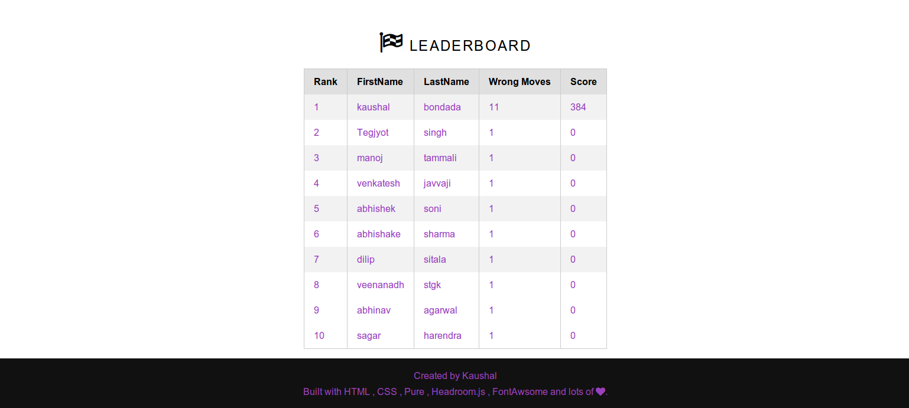

HangMan
=======

Hangman is a paper and pencil guessing game for two or more players. One player thinks of a word, phrase or sentence and the other tries to guess it by
suggesting letters or numbers. This is an exact simulation of the game with computer.

##Overview

The word to guess is represented by a row of dashes, giving the number of letters, numbers and category. If the guessing player suggests a letter or number
which occurs in the word, the other player writes it in all its correct positions. If the suggested letter or number does not occur in the word, the other
player draws one element of the hanged man stick figure as a tally mark. The game is over when:

* The guessing player completes the word, or guesses the whole word correctly
* The other player completes the diagram:
* This diagram is, in fact, designed to look like a hanging man. Although debates have arisen about the questionable taste of this picture it is still in

* use today. A common alternative for teachers is to draw an apple tree with ten apples, erasing or crossing out the apples as the guesses are used up.

Multilayer feature is not available in the code. So here you always play with the computer

##Features

Their are several features has been included in this version of the code. Each feature would include certain level of customization difficulty at the end.

* You could **modify the word list** and play with the newly customized list. '(Hard)'
> modify the files in the **/src/input/** to have different words keeping the name same

* you have the **leader board**. Which allows you to keep track of your score wrt to other who play '(Easy)' 
* Easy and **intuitive Game play** interface to enjoy the game '(Easy)'
* Ability to **Customize the game difficulty** with game settings '(Medium)'

##GamePlay

You start with the home screen.

You can click the *get started* or directly go to *game settings* to customize, You have three levels of difficulty to choose

And you can click the *Play Now*  which would take you to the Game Screen. Which includes a cube which show the current status and all other details which
you have selected for this level

After the finish of the game. The game takes you to the leader board which includes the top 10 high scorers of the game.

## Implementation 

The whole project follows the **JavaEE** framework and strictly adheres to the MVC Architecture.

* **Model**: There is a *Player class* in *src/model/*. Which is the model which we are sharing among all the Views and Controllers.
* **Controller**: Its a Servlet named *GameServlet.java* at *src/servlet/* which handles and validates all the requests from all the Views.
* **Views**: There are two views name *HomeScreen.jsp* and *GameScreen.jsp*  at *WebContent/* which are written in several technologies. Details would be clearly provided

The whole front end is at Location *WebContent* folder of the repository. It consist mostly of HTML, CSS and few Validations by JavaScript.
I have used several tools like

* [Pure](http://purecss.io/): This is used to fix the layouts, Grids and Buttons
* [HeadRoom.js](http://wicky.nillia.ms/headroom.js/): This is used to animate the top menu  based on the gestures to increase the Screen Size.
* [FontAwsome](https://fortawesome.github.io/Font-Awesome/) and [Glyph Search](http://glyphsearch.com/): These were used to gather all the Icons and Glyphs.
* [TypeWonder](http://typewonder.com/): This is used to set Different Fonts through out the frontend.
* [ColorCo](http://colourco.de/): This was used to pick the colors and finding the matches to other colors.
* [Amimation Cheat Sheet](http://www.justinaguilar.com/animations/index.html): This was used to set all the animations throughout the website.

to construct the frontend.

I Hope You would enjoy the Game and Customize for your sake. I would happy to know for any further improvements on the project.

## Pending Tasks

- [x] Tested For Accuracy.
- [] Need to add Proper Finish Alerts.
- [] Need to Deploy and Give a public IP.
